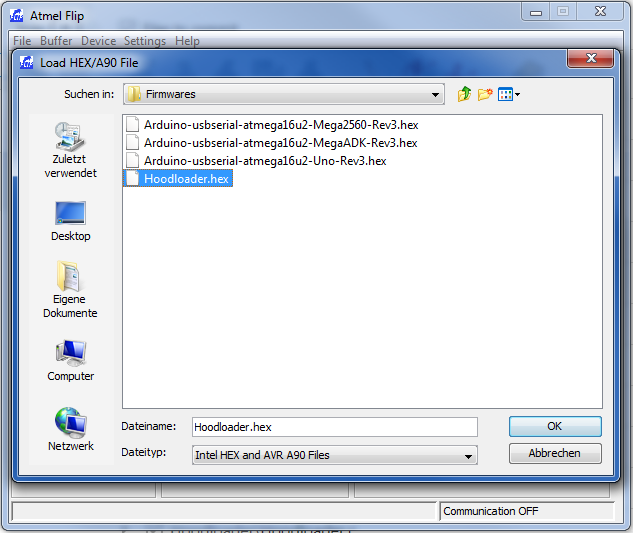

Install new Firmwares with DFU and Flip on Arduino Uno/Mega R3
==============================================================
From: http://nicohood.wordpress.com/2014/06/03/install-new-firmwares-with-dfu-and-flip-on-arduino-unomega-r3/
This article is mainly made as an explanation on how to install the Hoodloader which is included in the HID Project.
But you can also flash other firmwares to your Arduino. **This tutorial is for Windows and R3 versions only.**
This method is called “Device Firmware Upgrade” and also works on Linux/Mac and older versions but its not explained in this article.

**What you need: Arduino Uno/Mega, USB Cable, a normal jumper wire, Flip**

Flashing the new firmware
=========================

Install Flip first. This will also install the needed DFU drivers to flash the new firmware. Start Flip.

**_Briefly_ short these two pins** of the 16u2 with a Wire **(the jumper is only to show the connection)**.
If you have an older Version than the R3 please google how to get in DFU mode.
Today everybody should have an r3 so no resistor and complicated stuff is needed.

The device should now show up as Atmega16u2 in the device manager.
If not or if you get Error: **“AtLibUsbDfu.dll not found”** install the drivers manually from the device manager.
Right click the unknown device and select the Flip installation path to search the drivers.

Click the IC Button an select **Atmega16u2. (same for Uno/Mega).**

**Click File->Load Hex File** and select the Firmware. (The Lite version is only if you have any bugs. Please report bugs.)

Click the USB Cable and **click open.**

**Click run** to upload the firmware. Uncheck Reset and click Start Application to restart your Arduino. Or just **replug the cable.**

You probably need to **install new drivers for the new firmware.** Right click the device in the device manager and select the .inf file
provided with the firmware. Or just right click the .inf file and hit install.

You are done! Have fun with your new Arduino Firmware.

Deactivate HID function
=======================
Its possible to deactivate HID if you messed up something in the code and cannot return easily.
Just short these two pins permanently until you have uploaded your new, working sketch:

See http://nicohood.wordpress.com/ for more tutorials and projects