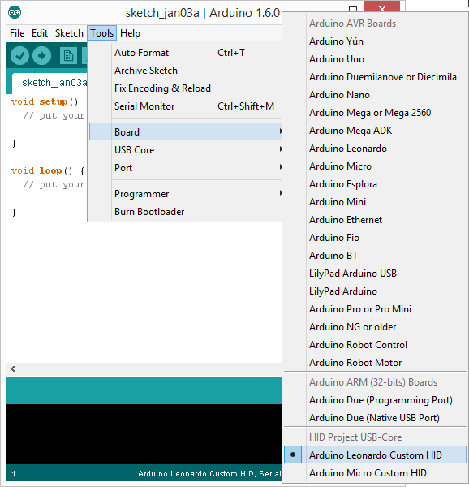
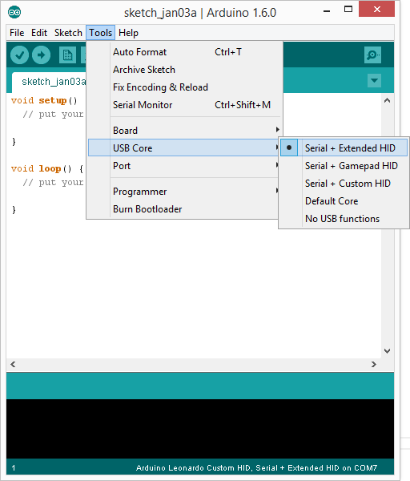

Arduino HID Project 2.1
=======================


This project went through a lot of phases and has now reached a new Arduino USB-Core
with a lot of new functions like extended HID. It also supports HoodLoader1+2.
The idea is to enable enhanced USB functions to almost all 'standard' Arduino boards.

**Supported Arduinos (IDE 1.5.8 or higher!):**
* Uno (with HoodLoader1 or 2)
* Mega (with HoodLoader1 or 2)
* Leonardo
* (Pro)Micro
* Any other 8u2/16u/at90usb162/32u2/32u4 compatible board

**Main features of the new USB-Core:**

* New HID devices(list below)
* HID reports are easier to modify now
* HID APIs are external usable now
* USB Wakeup
* Smaller flash/ram usage
* More Serial functions
* u2 Series support (with [HoodLoader2](https://github.com/NicoHood/HoodLoader2))
* [HoodLoader1](https://github.com/NicoHood/HoodLoader) compatible legacy example
* See change log for more additions and fixes

**Supported HID devices:**

* Keyboard with Leds out (modifiers + 6 keys pressed at the same time)
* Mouse (5 buttons, move, wheel) + Absolute Mouse
* Media Keys (4 keys for music player, webbrowser and more)
* System Key (for PC standby/shutdown)
* Gamepad (32 buttons, 4 16bit axis, 2 8bit axis, 2 D-Pads)

Installation
============

For Arduino Uno/Mega first install [HoodLoader2](https://github.com/NicoHood/HoodLoader2) on your 16u2 + the needed software files.
Make sure your HoodLoader2 software is up to date when you also update the HID-Project files.
[HoodLoader1](https://github.com/NicoHood/HoodLoader) is only supported for legacy but will get a new use soon!
For Arduino Micro/Leonardo ignore this step.

Installation has changed over the time. Put all files from *avr/* into *sketchbook/hardware/HID/avr*.
Make sure you use Arduino IDE 1.5.8 or newer. You don't have to modify the original core any more.

At the moment you have to move the cores/hid folder into your Arduino installation
*arduino-1.6.0/hardware/arduino/avr/cores/hid* because of a bug in the IDE.

**Your sketchbook folder should look like this:**


If you like to, you can add the keywords.txt to your Arduino IDE so that words like 'Gamepad' are highlighted.
Replace the file in *arduino-1.6.0/lib/keywords.txt* with the *keywords.txt* provided in this project.

How to use
==========

### Micro/Leonardo + HoodLoader2

**1. Select the new board via *Tools->Board->Arduino Leonardo HID-Project* for example.**
For HoodLoader2 select the 16u2 MCU. Ensure HoodLoader2 board definition files are up to date.



**2. Select the USB-Core you want to use. You have 5 options here:**

* Extended (Keyboard+Leds, Mouse+Absolute, Consumer, System)
* Gamepad (Keyboard+Leds, Mouse, Gamepad)
* Custom (Your custom configuration, see below)
* Default Core (Standard Arduino Core)
* No USB Core (No USB functions available, saves ram + flash)



To create a **custom HID report descriptor** you can edit the file in *avr/variants/leonardo_custom/pins_arduino.h*.
Same for Micro and HoodLoader2. Not all HID reports are playing well together on all OS so I made these pre selections.
With the custom report you can try it out yourself. Everything you need should be in the pins_arduino.h file.

**3. Try the Basic HID examples for each HID device. They are pretty much self explaining.
You can also see the *Projects/HID_Test* for an all in one example.**

See *Project/USB-Serial* for a fully usable USB-Serial bridge and how to use the new Serial functions.
In the CDC.h you can also see the new Control Line functions for advanced users.
Keep in mind that the USB_ENDPOINTs for the u2 Series are set to 16 bytes, so the Serial buffer is also smaller (normally 64b).

### HoodLoader1 (legacy, new stuff coming soon)

**Try the HoodLoader1 example. It provides the basic Serial protocol API to send HID reports. You have to copy this to every sketch again.**

With HoodLoader1 you can **only use baud 115200 for HID** due to speed/programming reasons.
Use Serial.begin(115200) in every HoodLoader1 sketch.
Its not bad anyway because its the fastest baud and you want fast HID recognition.
You still can **fully use any other baud** for normal sketches but HID wont work.
If you try nevertheless it will output Serial crap to the monitor.

Keep in mind that HoodLoader1 has **no flush function**. If the PC is reading HID too slow it can miss data, like on a Raspberry Pi.
Add a delay to the sending function or just use the newer HoodLoader2.
Do not use HID in interrupts because it uses Serial. Your Arduino can crash!

Always release buttons to not cause any erros. Replug USB cable to reset the values if anything went wrong.
Keep in mind that **with HoodLoader1 the 16u2 is always on**. The 16u2 and its HID reports are not reset if the main MCU is reset.
So you need to reset the HID reports on every startup with a begin() of each used API.
On Windows every USB report will reset when you open the lock screen.
See [deactivate HID function (Hoodloader only)](https://github.com/NicoHood/Hoodloader) how to temporary disable HID again.

For **16u2 as ISP usage** (optional, Hoodloader only, has nothing to do with HID function)
see [Hoodloader repository](https://github.com/NicoHood/Hoodloader).

The sending API is no longer integrated directly in the HID Project since it is now more an extended USB-Core and this has nothing to do with it.
Its more a legacy version to still use HoodLoader1 or to reimplement something similar with HoodLoader2 if you still want full report access for the main MCU.

**The older, full integrated HID Core can be found here.** Keep in mind to remove all newer stuff since it may conflict (a clean arduino core would do it).
It is not better than this solution, maybe easier to use since its just more integrated.
[Outdated HID Project for 1.5.7](https://github.com/NicoHood/HID/tree/3d8a9b40752a143141b8be4b8f744e203c80b000)


How it works
============
For the Leonardo/Micro + HoodLoader2 its a modified version of the HID descriptors and USB-Core.
This changes were made to improve the functions, add more devices and add u2 series compatibility.

The HID project contains HID APIs to generate HID reports and functions to send them to the USB Host.
The API (syntax/usage) of the HID Project is always the same for each solution, **you can port code from one device to another very easy**.

* On a Leonardo this function is extended and improved to get more HID devices + some improvements.
* [HoodLoader2](https://github.com/NicoHood/HoodLoader2) is a BootLoader for the 16u2 that let's you use it as standalone MCU with the same USB-Core.
* [HoodLoader1](https://github.com/NicoHood/HoodLoader) is a 16u2 firmware that filters special HW Serial signals from the main MCU and sends HID signals to the USB Host.

To make things more clear the HID Software is in a separate repository than the HoodLoader (1 & 2) sources and installing instructions.
**HoodLoader 1&2 is only used for an Uno/Mega to actually enable USB functions.** The 16u2 is normally used for USB-Serial programming of the main MCU but can do way more than that.
To use HoodLoader1&2 you also need the HID Project. For more information and installation instructions see the specific repository.

HoodLoader1 was the first solution to enable HID functions to the Uno/Mega but HoodLoader2 opens way more options because you can reprogram the whole MCU standalone.
See the repository for more infos about this great new opportunity. HoodLoader1 API is still usable in a specific example. HoodLoader1&2 are not needed/compatible with a Leonardo/Micro.


HoodLoader1 only:
For the Uno/Mega you need a special Bootloader(actually firmware in this case). Why? See [Hoodloader repository](https://github.com/NicoHood/Hoodloader).
To sum it up: Serial information is grabbed by the "man in the middle, 16u2" and you dont have to worry to get any wrong Serial stuff via USB.
Thatswhy you need a special baud (115200) that both sides can communicate with each other.
Every USB command is send via a special [NicoHood Protocol](https://github.com/NicoHood/NicoHoodProtocol)
that's filtered out by the 16u2. If you use Serial0 for extern devices it cannot filter the signal of course.
You can still use the NHP, just don't use the reserved Address 1.


TODO
====

Under Construction. This is a todo list for myself.

```
Keyboard Layout for different Languages
Clean up USB Core code from fixed values. Use better understandable definitions
Magic key fix for 32u4?

keycode/raw for keyboard
Check Keyboard keycode function again? + add example
Generalize HID key definitions via HIDTables for example?

update Burning via ISP (advanced)
Test with Android phone (HL1)
"Emulate" HL1 protocol
test no usb function with leonardo (usb workaround?)
```


Known Bugs
==========
* See Hoodloader1+2 repositories for HoodLoader1+2 related Bugs/Issues.
* Mouse Abs only works with system report under special circumstances.
* Gamepad + Mouse Abs doesnt work together
* Core selection in boards.txt is not working
* Do not name the Arduino Sketch 'Mouse.ino' or 'Keyboard.ino' etc.
Your Arduino IDE will output errors then if you double click the file and try to compile.
* RawHID is not working properly, test it at your own risk.
* Feel free to open an Issue on Github if you find a bug. Or message me via my [blog](http://nicohood.wordpress.com/)!
* All OS have some problems with Gamepads. Dont use more than one device for Linux and be careful when you change the descriptor.
* XBMC 13.1 (a Media Center) uses Gamepad input. Its seems to not work and may cause weird errors.
Even with a standard Gamepad I have these errors. Just want to mention it here.
* The Serial may disconnect if you have too much throughput. This is a general bug of the Arduino Core,
which might be fixed. For example Adalight dosnt work well for me,
so you better use an Arduino Uno with Hoodloader1 (yes the older one!) for Mediacenter control and Ambilight.


Version History
===============
```
2.1 Release (xx.01.2015)
* Reworked the whole USB-Core from scratch
* Uses less flash if HID or Serial is not used
* Extended and compacter(flash) HID Report Descriptors
* Fixed USB Device Descriptor
* Added u2 compatibility with smaller USB_EP_SIZE (16u2 etc)
* Added Serial Event for LineEncoding and LineState
* Added Serial Function to get dtr state, line encoding etc
* Added Keyboard Led Out report to get Led states (for numlock etc)
* Made CDC-Core independent from USB-Core
* Made HID-Core independent from USB-Core
* Made HID-API independent from HID-Core
* Removed not needed virtual functions in Keyboard
* Made HID Reports and its IDs replaceable via pins_Arduino.h
* Added Absolute Mouse
* Removed uint8_t USBPutChar(uint8_t c); in HID.cpp
* Made void Recv(volatile u8* data, u8 count) in USBCore.cpp static inline
* HID-APIs sends a clean report on begin() and end() now.
* Removed virtual functions in Keyboard API
* Added Keycode functions in Keyboard API
* Inlined a lot of the HID API functions to save flash
* Added Gamepad
* Added USB Wakeup support
* Separated USB-Core in its own folder
* Added HID Tables
* USB-Serial now fully reprogrammable
* Easy USB-Core selection via Tools->USB-Core

2.0 Release (29.11.2014)
* Added HoodLoader2
* Separated HoodLoader1&2 more
* Added u2 series for USB-Core
* Extended USB core and fixed minor things for the u2 series
* Added Led Out report.
* Added CDC Line state
* Reworked the whole library structure again

1.8 Beta Release (26.08.2014)
* Changes in the Hoodloader:
 * **Huge improvements**, see [Hoodloader repository](https://github.com/NicoHood/Hoodloader)
 * Reworked the whole library, easy installation now
 * HID fixes for Media Keys/Ubuntu
 * Removed Joystick, added 4 Gamepads

1.7.3 Beta Release (10.08.2014)
* Changes in the Hoodloader:
 * Fixed HID flush bug (1.6 - 1.7.2)

1.7.2 Beta Release (10.08.2014)
* Changes in the Hoodloader:
 * Added Lite version for 8u2
 * Added Versions that show up as Uno/Mega (not recommended)
 * Makefile and structure changes

1.7.1 Beta Release (10.08.2014)
* Changes in the Hoodloader:
 * Fixed HID deactivation bug

1.7 Beta Release (10.08.2014)
* Changes in the Hoodloader:
 * Works as ISP now. See the [Hoodloader Repository](https://github.com/NicoHood/Hoodloader) for more information.
 * Exceeded 8kb limit. For flashing a 8u2 use v1.6 please!
* Changed Readme text

1.6 Beta Release (09.08.2014)
* Bugfixes in the Hoodloader:
 * Changed HID management (not blocking that much, faster)
 * added RawHID in/out (HID to Serial)
* Added RawHID Class and example

1.5 Beta Release (21.07.2014)
* Moved Hoodloader source to a [separate Github page](https://github.com/NicoHood/Hoodloader)
* Bugfixes in the Hoodloader:
 * Firmware is still available here
 * Overall a lot of ram improvements, now with a big global union of ram
 * Removed USBtoUSART buffer (not needed, saved 128/500 bytes)
 * Removed Lite version because of better ram usage not needed
 * Separated different modes better to not cause any errors in default mode
 * Improved the deactivate option
 * Integrated NHP directly
 * Replaced LightweightRingbuffer with native Lufa Ringbuffer
 * Improved writing to CDC Host
 * Fixed a bug in checkNHPProtocol: & needs to be a ==
 * General structure changes
 * Improved stability
 * Fixed Arduino as ISP bug

1.4.1 Beta Release (10.07.2014)
* #define Bugfix in USBAPI.h

1.4 Beta Release (10.07.2014)
* Bugfixes in the Hoodloader:
 * Added Lite Version with less ram usage
 * Changed PIDs, edited driver file
* merged v1.0.x and v1.5.x together (both are compatible!)
* added IDE v1.5.7 support
* added Tutorials

1.3 Beta Release (01.07.2014)
* Bugfixes in the Hoodloader:
 * Improved ram usage (you can get even better but that messes up code and increases flash)
* **Important NHP fix inside the HID Class for Uno/Mega**

1.2 Beta Release (22.06.2014)
* Added 1.0.x/1.5.x support
* Bugfixes in the Hoodloader:
 * Sometimes HID Devices weren't updating when using more than 1 Device (set forcewrite to true)
 * Fast updates crashed the bootloader (too much ram usage, set CDC buffer from 128b to 100b each)
* Minor file structure changes

1.1 Beta Release (05.06.2014)
* Added Leonardo/Micro support
* Included NicoHoodProtocol
* Minor fixes

1.0 Beta Release (03.06.2014)
```

Useful Links/Credits
====================

* [LUFA from Dean Camera](http://www.fourwalledcubicle.com/LUFA.php)
* [Darran's HID Projects] (https://github.com/harlequin-tech/arduino-usb)
* [Connor's Joystick for the Leonardo](http://www.imaginaryindustries.com/blog/?p=80)
* [Stefan Jones Multimedia Keys Example](http://stefanjones.ca/blog/arduino-leonardo-remote-multimedia-keys/)
* [Athanasios Douitsis Multimedia Keys Example](https://github.com/aduitsis/ardumultimedia)
* [The Original Arduino Sources](https://github.com/arduino/Arduino/tree/master/hardware/arduino/firmwares/atmegaxxu2/arduino-usbserial)
* [USBlyzer](http://www.usblyzer.com/)
* [Mattairtechs 16u2 Lufa USB Core](https://www.mattairtech.com/index.php/development-boards/mt-db-u1.html)
* [Paul Brook's Minimus 32u2 Arduino USB Core](https://github.com/pbrook/minimus-arduino)
* [Paul Stoffregen's Teensy Core](https://github.com/PaulStoffregen/cores)
* [Keyboard Led Out report by hartmut_holgraefe](http://forum.arduino.cc/index.php?topic=173583.0)
* [Github Pull Request with a lot of new functions](https://github.com/arduino/Arduino/pull/1803)
* A lot of searching through the web
* The awesome official Arduino IRC chat!
* [The NicoHood Protocol ^.^](https://github.com/NicoHood/NicoHoodProtocol)
* See HoodLoader1&2 repository for more credits/links
* [Hackaday post about HoodLoader2](hackaday.com/2014/11/30/using-the-second-microcontroller-on-an-arduino)
* [Gamecube to PC adapter](https://github.com/NicoHood/Nintendo)
* See http://nicohood.wordpress.com/ for more tutorials, projects and contact.
* For donations please contact me on my blog :)

For Developers
==============
If you deactivate some reports it can occur that windows will cause problems and recognize it as different device.
While developing I had that much trouble that I had to change the PID. No way to repair the broken windows driver settings.
So be careful if you change the source on your own with important PIDs.
Therefore reinstall the divers for any device or just dont touch the HID reports.

See this how to uninstall the drivers:
https://support.microsoft.com/kb/315539

```
Include schematic
- Arduino.h
 - USBAPI.h -> Arduino.h, USBDESC.h, USBCore.h
 - CDC.h -> Arduino.h, USBDESC.h, USBCore.h
 - HID.h -> Arduino.h, USBDESC.h, USBCore.h, HID-APIs(Keyboard.h, Mouse.h, etc)
  - Keyboard.h -> Arduino.h
  - Mouse.h -> Arduino.h
  - [Other APIs].h -> Arduino.h
 - HIDTables.h

HID.h contains all HID configuration.
Each HID-API (like Mouse) includes Arduino.h and gets these settings as well.
The pins_Arduino.h can overwrite each HID descriptor or define complete new one.
```

Licence and Copyright
=====================
If you use this library for any cool project let me know!

```
Copyright (c) 2014 NicoHood
See the readme for credit to other people.

Permission is hereby granted, free of charge, to any person obtaining a copy
of this software and associated documentation files (the "Software"), to deal
in the Software without restriction, including without limitation the rights
to use, copy, modify, merge, publish, distribute, sublicense, and/or sell
copies of the Software, and to permit persons to whom the Software is
furnished to do so, subject to the following conditions:

The above copyright notice and this permission notice shall be included in
all copies or substantial portions of the Software.

THE SOFTWARE IS PROVIDED "AS IS", WITHOUT WARRANTY OF ANY KIND, EXPRESS OR
IMPLIED, INCLUDING BUT NOT LIMITED TO THE WARRANTIES OF MERCHANTABILITY,
FITNESS FOR A PARTICULAR PURPOSE AND NONINFRINGEMENT. IN NO EVENT SHALL THE
AUTHORS OR COPYRIGHT HOLDERS BE LIABLE FOR ANY CLAIM, DAMAGES OR OTHER
LIABILITY, WHETHER IN AN ACTION OF CONTRACT, TORT OR OTHERWISE, ARISING FROM,
OUT OF OR IN CONNECTION WITH THE SOFTWARE OR THE USE OR OTHER DEALINGS IN
THE SOFTWARE.
```