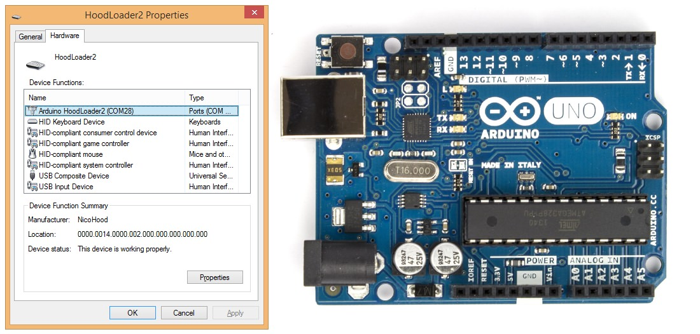

# Arduino HID Project

This project went through a lot of phases and has now reached a new Arduino ~~USB-Core~~ Library
with a lot of new functions like extended HID. It also supports HoodLoader2 (version 1 is no longer supported).
The idea is to enable enhanced USB functions to almost all 'standard' Arduino boards.

**Supported Arduinos (IDE 1.6.7 or higher!):**
* Uno (with [HoodLoader2](https://github.com/NicoHood/HoodLoader2))
* Mega (with [HoodLoader2](https://github.com/NicoHood/HoodLoader2))
* Leonardo
* (Pro)Micro
* Any other 8u2/16u2/at90usb8/162/32u2/32u4 compatible board
* Zero
* MKR1000
* Any other Samd21 compatible board
* No ATSAM3 support (Due, etc)

**Supported HID devices:**
* Keyboard with Leds out (8 modifiers + 6 keys pressed at the same time, + 1 limited linux consumer key)
* ~~Teensy Keyboard with different keyboard layouts (german, french and many more)~~ soon
* NKRO Keyboard with Leds out (press up to 113 keys at the same time)
* Mouse (5 buttons, move, wheel)
* BootKeyboard/BootMouse BIOS protocol support
* Absolute Mouse
* Consumer/Media Keys (4 keys for music player, web browser and more)
* System Key (for PC standby/shutdown)
* Gamepad (32 buttons, 4 16bit axis, 2 8bit axis, 2 D-Pads)
* RawHID
* SurfaceDial
* Each device is available as single or multi report device (except RawHID)

See the [wiki](https://github.com/NicoHood/HID/wiki/Features) for more information about features etc.

## Wiki

All documentation moved to the [wiki page](https://github.com/NicoHood/HID/wiki).

## Contact

www.nicohood.de

**If you have any questions, please ask at the [Github Discussions Page](https://github.com/NicoHood/HID/discussions).**

